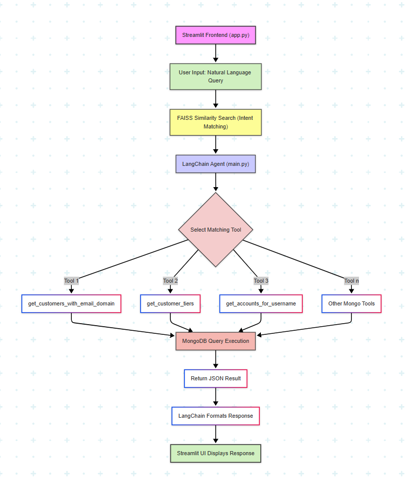

# 🧠 Conversational DB Agent

Chat with your **MongoDB** database using **natural language queries**! 

    - This AI-powered agent understands user queries from natural language

    - Convert user queries into MongoDB queries to extract requiered data from database

    - Use Agenetic Reasoning to returns insightful results.

---

## 🚀 Features

- 💬 Chat interface using `Streamlit`
- 🧠 Intent matching via semantic similarity search using `FAISS`.
- 🔌 Connects to MongoDB collections (`accounts`, `transactions`, `customers` from `sample_analytics` database)
- 🤖 Agent-based architecture using `LangChain`
- 📚 Sample question dataset for guided queries
- 🔎 Tools for structured DB retrieval: get customer tiers, accounts, transactions, etc.
- Handle `Multiple database operations`in one
conversation
- `Error Handling` for ambiguous/ impossible
queries
---


## ⚙️ Setup Instructions

### 1. Clone the Repository

```bash
git clone https://github.com/your-username/conversational-db-agent.git
cd conversational-db-agent
```

### 2. Install Dependencies

We recommend using a virtual environment:

```bash
python -m venv venv
source venv/bin/activate  # or venv\Scripts\activate on Windows

pip install -r requirements.txt
```

### 3. Configure Environment Variables

Create a `.env` file in the root directory:

```bash
MONGO_URI="your-mongodb-uri"
GOOGLE_API_KEY="your-generative-ai-key"
```

### 4. Run the App

```bash
streamlit run app.py
```

The app will open in your browser at `http://localhost:8501`.

---
# 🧠 Conversational Database Agent - Architecture

- The system allows users to query a MongoDB database using natural language, powered by LangChain Agent, Google Generative AI Chat Model, and Streamlit for an interactive UI.

---

## 📌 High-Level Overview


---

## 🧱 Components

### 1. Streamlit Frontend (`app.py`)
- Provides a chat-based user interface.
- Displays both user queries and agent responses.
- Handles session management and chat history.

### 2. LangChain Agent (`main.py`)
- Central logic for handling natural language input.
- Uses LangChain tools and memory for interactive querying.
- Integrates a custom toolset for MongoDB operations.

### 3. Tools
Functions registered with the LangChain agent to perform specific DB operations:
- `get_customer_tiers`
- `get_customers_with_email_domain`
- `get_accounts_for_username`
- And many more defined in `main.py`.

### 4. FAISS Vectorstore
- Performs similarity search to identify user intent.
- Matches user input with stored intents from `sample_questions.json`.

### 5. MongoDB Database
- Primary data source (MongoDB Atlas or local).
- Collections: `customers`, `accounts`, `transactions`.

---

## 🔁 Data Flow
<div style="text-align: center;">
    
</div>

1. **User enters natural language query in Streamlit chat.**
2. **app.py** sends the query to the agent (`agent.run(user_input)`).
3. **Vectorstore** checks the query against `sample_questions.json` for intent matching using FAISS.
4. **LangChain Agent**:
   - Determines the best matching tool or route.
   - Executes the appropriate function (Tool).
5. **Tool executes MongoDB query** using `pymongo`.
6. **Extracted data** from databse analyzed by Agent and outputs structured response for user query in natural language.
6. **Response** is returned from Agent → Streamlit.
7. **User sees the assistant's response** in the chat.

---

## 🧠 Technologies Used

| Component            | Technology              |
|---------------------|-------------------------|
| UI                  | Streamlit               |
| LLM Integration     | LangChain + Google GenAI|
| Vector Database     | FAISS                   |
| Backend Logic       | Python + LangChain Tools|
| Database            | MongoDB (via PyMongo)   |

---

## 🗂 Directory Structure

```
├── app.py                      # Streamlit frontend app
├── main.py                     # Core agent logic and tools
├── .env                        # MongoDB URI KEY and LLM API KEY
├── requirements.txt            # Python dependencies
├── sample_questions.json       # Pre-defined sample questions for few shot learning
├── README.md                   # Project documentation (you are here)
```

---

## 🔐 Environment Variables

Stored in a `.env` file:

- MONGO_URI=your_mongodb_connection_string
- GOOGLE_API_KEY=your_google_genai_api_key


---

## 💡 Sample Questions

Sample questions are loaded from `sample_questions.json` to help agent to analyze different types of user’s  query intent. Examples:

- "Show me transactions greater than 1000 for account 328304."
- "List customer tiers and their benefits."
- "Retrieve all customers with '@gmail.com' email."

---
